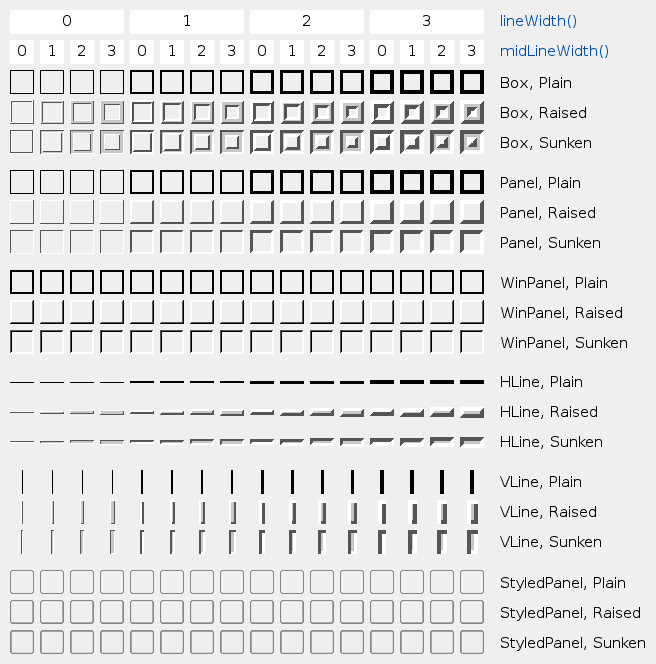

 > 
 > The QFrame class is the base class of widgets that can have a frame

Frame 就是边框. 单独的 QFrame 类就是显示一个边框, 然后没了.

使用方式如下:

````cpp
QLabel label(...);
label.setFrameStyle(QFrame::Panel | QFrame::Raised);
label.setLineWidth(2);

QProgressBar pbar(...);
label.setFrameStyle(QFrame::NoFrame);
````


