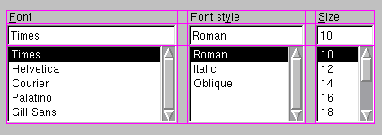

 > 
 > The QGridLayout class lays out widgets in a grid.

该 layout 提供经典的单元格布局. (或者叫它 excel 布局似乎也挺形象的...?)

行 (row) 和列 (column) 是对等的, 对行有的方法对列也有, 下面主要对列进行介绍.

要想把一个 Widget/Layout 加入到特定的 cell 中, 可以使用 `addWidget` 方法. 这个方法会自动调整加入的子组件的大小和整个行/列的大小. 

与 [QBoxLayout](QBoxLayout.md) 类似, 它也有 `removeWidget`, `hide` 和 `show` 方法, 并且如果不是顶层 layout 的话必须先加入到父 layout 中才能进行其他操作. 同样的, 它也有 `setContentsMargin` 和 `spacing` 方法来设置自己的间距大小和子元素之间的间距大小.
