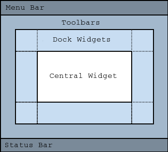

它为应用的主窗口提供了一个有效的 "默认组件+布局":



其默认 Layout 使得我们可以直接添加代表各部分的组件而不需要指定它们的位置, 如 *QToolBar*, *QDockWidget* 和 *QMenuBar*, *QStatusBar*. 一个 QMainWindow 必须且只能有一个中心组件 (即图中的 Central Widget). 当我们不知道要往中心放什么东西, 或者说我们想要往中心放多个东西的时候, 我们就会往里面放一个 [QFrame](QFrame.md) 然后再丢东西进去.

### Menu

QMainWindows 提供了 *QMenuBar*, 里面可以放 *QMenu*; 而 *QMenu* 里面又可以放 *QAction* 来代表动作:

````cpp
void MainWindow::createMenus()
{
    fileMenu = menuBar()->addMenu(tr("&File"));
    fileMenu->addAction(newAct);
    fileMenu->addAction(openAct);
    fileMenu->addAction(quictAct);
````

*QAction* 随后可以通过绑定信号来在被触发的时候执行特定动作:

````cpp
connect(quitAct, &QAction::triggered, qApp, QApplication::quit);
````

### ToolBar

工具栏类似菜单栏, 基本用法相同:

````cpp
void MainWindow::createToolBars()
{
    fileToolBar = addToolBar(tr("File"));
    fileToolBar->addAction(newAct);
````

### Dock Widget

如果你的程序是类似 PS 或者是那种老式工具, 自己提供了一套窗口内套窗口的逻辑的 (Qt 里将其称为 multiple document interface, MDI, 使用 *QMdiArea* 处理), 那么这个地方就可以拿来放窗口的标签页 (比如 *QTabBar*).

虽然但是, 我觉得这种交互 UI 好毒瘤哦...
