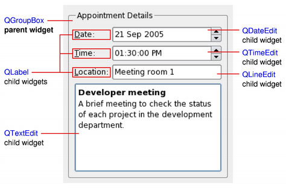

 > 
 > The QWidget class is the base class of all user interface objects.

是所有用户界面程序的基类 (也就是说, 能被看到的东西就应该是一个 [QWidget](QWidget.md)), 同时也是一个最小的界面元素的单元. 它可以接受各种事件, 同时将自己的一个表示输出到屏幕上. 每一个 [QWidget](QWidget.md) 都是一个矩形, 在 Z 轴上座标排列. 

无父 QWidget 的 QWidget 被称为窗口 (Window), 起普通窗口的作用. 被封装好的 [QMainWindow](QMainWindow.md) 和 *QDialog* 是窗口的主要类型. (前者一般用于当作界面的主窗口, 后者则是显示各种通知)

一般而言, 如果一个 QWidget 需要放子 Widget, 它需要给自己设置一个布局 (Layout, 参见 [QLayout](QLayout.md)). 布局决定了其子元素如何在它之中排列.

QWidget 是 *QPaintDevice* 的子类, 这意味着它可以使用 [QPainter](QPainter.md) 来给自己绘制任意内容.

当实现一个新 Widget 时, 应该首先重写 `QWidget::sizeHint()` 方法来为其提供一个合理的初始大小. 它的默认行为是根据子 Widget 的大小来计算出自己的默认大小.
