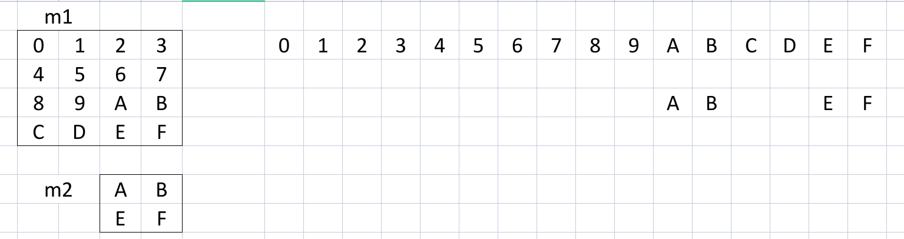

The `memref` dialect is intended to hold core memref creation and manipulation ops, which are not strongly associated with any particular other dialect or domain abstraction.

## 类型定义

Ref: https://mlir.llvm.org/docs/Dialects/Builtin/#memreftype

MemRef 类型在 [Builtin Dialect](Builtin%20Dialect.md) 中被定义.

````
memref-type ::= `memref` `<` dimension-list-ranked type
                (`,` layout-specification)? (`,` memory-space)? `>`
layout-specification ::= attribute-value
memory-space ::= attribute-value
````

一个 MemRef 代表一块内存区域, 它具有:

* 基本类型: 里面单个元素的基本类型, 它可以是:
  * 内建的整数, 索引, 浮点类型
  * 内建的向量类型和 MemRef 类型
  * 任何其它实现了 `MemRefElementTypeInterface` 接口的类型
* 形状 (shape)
  * 有阶和维度的概念, 同样有 `*` 代表任意阶和 `?` 代表长度未知维度.
  * 可以任意嵌套, `1x0` 跟 `0x1` 不认为是相同的类型
* 布局模式 (layout): 指定这个多维的地址空间 (索引) 如何映射到线性地址空间 (地址) 的模式
  * 不能具有内部别名: 两个不一样的, 非越界索引必须被映射到不同的地址上
  * 内建方言提供了两种现成的布局模式: 仿射变换模式 (affine map) 和 基于步长的模式 (strided)

它这个 "一块" 并**不一定是连续的一块**, 也**不一定是独占的一块**. 它可以是在真正的线性内存中跳着选的一块, 也可以是另一个 MemRef 或者被其它对象所持有的一块内存的视图. 

如果两个 MemRef 的布局模式不同, 那么它们的类型也不同. 换言之, `memref<4xi32>` != `memref<4xi32, strided<[1], offset: 2>`, 即使它们只有偏移不同.

### 布局模式

#### 仿射布局模式

仿射布局模式相当于直接提供一个 (功能有限制的) 地址计算函数 ([半仿射变换](Affine%20Dialect.md#ban-fang-she-bian-huan)) 作为布局模式. 常见的仿射布局有下面这些:

````mlir
// MxN matrix stored in row major layout in memory:
#layout_map_row_major = (i, j) -> (i, j)

// MxN matrix stored in column major layout in memory:
#layout_map_col_major = (i, j) -> (j, i)

// MxN matrix stored in a 2-d blocked/tiled layout with 64x64 tiles.
#layout_tiled = (i, j) -> (i floordiv 64, j floordiv 64, i mod 64, j mod 64)
````

更多的例子如下:

````mlir
// Identity index/layout map
#identity = affine_map<(d0, d1) -> (d0, d1)>

// Column major layout.
#col_major = affine_map<(d0, d1, d2) -> (d2, d1, d0)>

// A 2-d tiled layout with tiles of size 128 x 256.
#tiled_2d_128x256 = affine_map<(d0, d1) -> (d0 div 128, d1 div 256, d0 mod 128, d1 mod 256)>

// A tiled data layout with non-constant tile sizes.
#tiled_dynamic = affine_map<(d0, d1)[s0, s1] -> (d0 floordiv s0, d1 floordiv s1,
                             d0 mod s0, d1 mod s1)>

// A layout that yields a padding on two at either end of the minor dimension.
#padded = affine_map<(d0, d1) -> (d0, (d1 + 2) floordiv 2, (d1 + 2) mod 2)>


// The dimension list "16x32" defines the following 2D index space:
//
//   { (i, j) : 0 <= i < 16, 0 <= j < 32 }
//
memref<16x32xf32, #identity>

// The dimension list "16x4x?" defines the following 3D index space:
//
//   { (i, j, k) : 0 <= i < 16, 0 <= j < 4, 0 <= k < N }
//
// where N is a symbol which represents the runtime value of the size of
// the third dimension.
//
// %N here binds to the size of the third dimension.
%A = alloc(%N) : memref<16x4x?xf32, #col_major>

// A 2-d dynamic shaped memref that also has a dynamically sized tiled
// layout. The memref index space is of size %M x %N, while %B1 and %B2
// bind to the symbols s0, s1 respectively of the layout map #tiled_dynamic.
// Data tiles of size %B1 x %B2 in the logical space will be stored
// contiguously in memory. The allocation size will be
// (%M ceildiv %B1) * %B1 * (%N ceildiv %B2) * %B2 f32 elements.
%T = alloc(%M, %N) [%B1, %B2] : memref<?x?xf32, #tiled_dynamic>

// A memref that has a two-element padding at either end. The allocation
// size will fit 16 * 64 float elements of data.
%P = alloc() : memref<16x64xf32, #padded>

// Affine map with symbol 's0' used as offset for the first dimension.
#imapS = affine_map<(d0, d1) [s0] -> (d0 + s0, d1)>
// Allocate memref and bind the following symbols:
// '%n' is bound to the dynamic second dimension of the memref type.
// '%o' is bound to the symbol 's0' in the affine map of the memref type.
%n = ...
%o = ...
%A = alloc (%n)[%o] : <16x?xf32, #imapS>
````

#### 基于步长的布局模式

基于步长的模式就是非常常见的下面这种模式:

$$
A\_{d_0, d_1, \cdots, d\_{n-1}} = \mathrm{offset} + \sum\_{i=0}^{n-1} d_i \*\\mathrm{stride}\_i 
$$
写成仿射变换就是:

````mlir
affine_map<(d0, ... dN)[offset, stride0, ... strideN] -> 
            (offset + d0 * stride0 + ... dN * strideN)>
````

它是变换到**以基元素为单位**的一维连续索引空间去, 而不是以字节为单位的内存地址空间. 举个例子, 假如我们想写一个行优先的 2x3x4 的数组, 那么我们就应该写: `memref<2x3x4xf32, strided<[12, 4, 1], offset: 0>>`. 然而这种情况实在是太常见了, 所以一般我们只会直接写 `memref<2x3x4xf32>`, 让编译器帮我们算出一个默认的 `strided` 来. 同时省略 `offset` 属性那就是默认为 0.

这种模式实际上是一个语法糖. 它能处理的情况仿射变换全都能处理, 但是这种情况能覆盖大部分索引模式, 所以单独给了一个.

### 例子



假如我们想要分配一块连续内存, 给 `m1`, 让它具有上面的这些内容和到行优先的到内存空间的布局. 同时创建一个视图给 `m2`, 让它成为一个 4x4 矩阵里的 2x2 视图, 那么我们可以这样写:

首先, 我们需要分配一块内存空间:

````mlir
%m1 = memref.alloc : memref<4x4xi32>

; 写得详细一点, 那就是:
; %m1 = memref.alloc : memref<4x4xi32, strided<[4, 1], offset: 0>>
````

然后我们写入一下数据:

````mlir
memref.store 0, %m1[0, 0] : memref<4x4xi32>
memref.store 1, %m1[0, 1] : memref<4x4xi32>
memref.store 2, %m1[0, 2] : memref<4x4xi32>
// 省略一大摞的 store
memref.store 15 %m1[3, 3] : memref<4x4xi32>
````

接着我们来创建一个视图:

````mlir
// 创建一个对 %m1 的视图, 它在两个维度上分别有偏移量 2 (第一个 [2, 2]), 
// 然后各个维度的长度都是 2 (第二个 [2, 2]), 各个维度的步长为 [2, 1]
// 由于原来的 memref 是 4x4 的, 一个相对原来的 [2, 2] 的偏移可以计算出总偏移为
// 2*4 + 2 = 10 个基元素, 所以结果的 memref 类型具有一个 offset: 10
%m2 = memref.subview %m1[2, 2][2, 2][2, 1]
    : memref<4x4xi32> to memref<2x2xi32, strided<[2, 1], offset: 10>>
````

## 分配/读取/写入

### `memref.alloc`

````
`memref.alloc` `(`$dynamicSizes`)` (`[` $symbolOperands^ `]`)? attr-dict `:` type($memref)
````

分配内存. 对于定长的 memref, 可以直接留空 `$dynamicSizes`, 直接靠类型信息分配; 对于不定长的就要给这个. 后边的 `$symbolOperands` 部分是给 affine 那边用的, 用于为仿射变换提供符号的值.

````mlir
// 分配内存, 直接通过后面的 memref 类型推断
%0 = memref.alloc() : memref<8x64xf32, 1>
// 分配内存, %d 被绑定到后面类型中的 ?
%1 = memref.alloc(%d) : memref<8x?xf32, 1>
// 带对齐地分配内存
%2 = memref.alloc() {alignment = 8} : memref<8x64xf32, 1>

// 表示对 %3[i, j] 的访问会访问到 [i + %s, j] 上
%3 = memref.alloc()[%s] : memref<8x64xf32,
                          affine_map<(d0, d1)[s0] -> ((d0 + s0), d1)>, 1>
````

### `memref.alloca`

````
`memref.alloca` `(`$dynamicSizes`)` ([` $symbolOperands^ `]`)? attr-dict  `:` type($memref)
````

在栈上分配内存. 使用同 \[\[MemoryRef Dialect#`memref.alloc`\|`memref.alloc`\]\].

### `memref.alloca_scope`

带作用域的栈上内存分配. 常见语言 (如 C++) 中, 经常在函数体内单开一个代码块来声明变量, 使得析构/资源释放等在离开该代码块后执行. 该操作的意图与其类似.

 > 
 > 无语法文档, 自己补充的

````
memref.alloca_scope $bodyRegion
````

````mlir
memref.alloca_scope {
  // 控制流每次流到这里就会进行一次内存分配
  %myalloca = memref.alloca(): memref<4x3xf32>
  ...
  // 流出了就没有了
}
````

````mlir
// %result 就是 %bodyRegion 里通过 memref.alloca_scope.return 返回的值 (即 %value)
%result = memref.alloca_scope {
  ...
  // 可以返回一个值
  memref.alloca_scope.return %value
  // 如果没有返回值的话, 可以直接不写 memref.alloca_scope.return 
}
````

### `memref.realloc`

````
`memref.realloc` $source (`(` $dynamicResultSize^ `)`)? attr-dict
              `:` type($source) `to` type(results)
````

调整 MemRef 的大小. 用法与注意事项如下:

````mlir
// 基本用法
%0 = memref.realloc %src : memref<64xf32> to memref<124xf32>
// 将未知大小的内存调整成已知的, 多丢少补
%1 = memref.realloc %src : memref<?xf32> to memref<124xf32>
// 完全动态的调整, 目标大小由 %d 决定
%2 = memref.realloc %src(%d) : memref<?xf32> to memref<?xf32>
// 带对齐的 realloc
%3 = memref.ralloc %src {alignment = 8} : memref<64xf32> to memref<124xf32>

// realloc 之后的旧内存不应该再使用
// 因为在大部分实现上, realloc 扩大内存会导致重新复制
%new = memref.realloc %old : memref<64xf32> to memref<124xf32>
%4 = memref.load %new[%index]   // ok
%5 = memref.load %old[%index]   // undefined behavior
````

### `memref.load`

````
`memref.load` $memref `[` $indices `]` attr-dict `:` type($memref)
````

获得 `$memref[$indices]` 中的数据.

### `memref.dealloc`

````
`memref.dealloc` $memref attr-dict `:` type($memref)
````

回收内存. 注意它显然不能对内存视图 (即没有所有权的内存) 做释放, 这显然会导致 double-free.

## 转换

### `memref.cast`

````
`memref.cast` $source attr-dict `:` type($source) `to` type($dest)
````

 > 
 > 为什么官方文档有两个 syntax?

实际上不能说是强转吧, 它只能在相容类型之间换. 而相容的要求非常严格:

* 必须有同样的基类型
* 具有相容的布局
  * 相同的布局是相容的 (即 4x4 的只能转到 4x4 的, 不能转到 16 的)
  * 带 `?` 的不确定的可以转过去也可以转过来 (比如 ?x4 可以转到 4x4, 同样不能转到 16)
  * 带不定阶的可以转过去也可以转过来 (比如 * 可以转到 4x4 或 16 或 2x2x2x?)

````mlir
// 从 ? 转到确定数值的过程相当于断言; 如果失败会丢运行时错误
%2 = memref.cast %1 : memref<?x?xf32> to memref<4x4xf32>
// Erase static shape information, replacing it with dynamic information.
%3 = memref.cast %1 : memref<4xf32> to memref<?xf32>

// The same holds true for offsets and strides.

// 不定阶 (unranked) 的转换
%4 = memref.cast %1 : memref<*xf32> to memref<4x?xf32>
%5 = memref.cast %1 : memref<4x?xf32> to memref<*xf32>

// 如果真的需要从 4x4 转到 16 的话, 需要这样: 4x4 -> * -> 16
// 并且也不能动基元素类型, 不可用把 i32 转成 f32
````

### `memref.reinterpret_cast`

能设定所有元信息 (阶, 各个维度, 各个偏移量, 各个步长) 的转换. 还是不能转换基类型.

````
`memref.reinterpret_cast` $source `to` `offset` 
            `:` custom<DynamicIndexList>($offsets, $static_offsets, "ShapedType::kDynamicStrideOrOffset") `,` `sizes` 
            `:` custom<DynamicIndexList>($sizes, $static_sizes, "ShapedType::kDynamicSize") `,` `strides` 
            `:` custom<DynamicIndexList>($strides, $static_strides, "ShapedType::kDynamicStrideOrOffset")
              attr-dict `:` type($source) `to` type($result)
````

 > 
 > custom\<\> 表示一个完全定制化的文法与数据类型

````mlir
memref.reinterpret_cast %ranked to
  offset: [0],
  sizes: [%size0, 10],
  strides: [1, %stride1]
: memref<?x?xf32> to memref<?x10xf32, strided<[1, ?], offset: 0>>

memref.reinterpret_cast %unranked to
  offset: [%offset],
  sizes: [%size0, %size1],
  strides: [%stride0, %stride1]
: memref<*xf32> to memref<?x?xf32, strided<[?, ?], offset: ?>>
````

### `memref.reshape`

改变一个 MemRef 的形状 (即阶数与各阶维度长度). 下面提到的 \[\[MemoryRef Dialect#`memref.collapse_shape`\|`memref.collapse_shape`\]\] 和 \[\[MemoryRef Dialect#`memref.expand_shape`\|`memref.expand_shape`\]\] 同样是改变形状, 但是它们只能用一个字面量来指定如何合并或拆分 MemRef 的.

TODO: 没搞懂

### `memref.collapse_shape`

在 C 语言里, 我们经常把一个二维数组 `a[N][M]` 压扁成一个一维数组 `a[N*M]`, 这种操作可以视为维度的坍缩 (collapse). 这个操作也是同理, 它允许你将一段连续的索引坍缩成一个.

**此操作不会创建新内存! 返回的是对旧内存的一个视图! 不要对它 dealloc!**

````
`memref.collapse_shape` $src $reassociation attr-dict `:` type($src) `into` type($result)
````

其中 `$reassociation` 指定了坍缩的方式, 例子如下:

````mlir
// Dimension collapse (i, j) -> i' and k -> k'
// [[0, 1], [2]]: [0, 1] 代表结果第 0 个维度是原来的第 0 个和第 1 个维度坍缩成的; [2] 代表结果的第 1 个维度是原来的第 2 个维度坍缩成的 
%1 = memref.collapse_shape %0 [[0, 1], [2]] :
    memref<?x?x?xf32, stride_spec> into memref<?x?xf32, stride_spec_2>
````

只能对后边跟着的, 连续的维度进行坍缩, 因为这种缩才是自然的缩. 显然我们不可能在不复制内存的情况下, 将一个三维数组 `a[A][B][C]` 缩成 `a[A * C][B]` 之类的, 只能缩成 `a[A*B][C]`, `a[A][B*C]`, `a[A*B*C]`.

特别地, 对于一个任意维度都只有单位长度的 MemRef, 它还可以坍缩成一个 0 阶的 MemRef, 此时 `$reassociation` 为空 (`[]`):

````mlir
%2 = memref.collapse_shape %unit [] : memref<1x1x1xf32> into memref<f32>
````

### `memref.expand_shape`

升维操作, 是 \[\[MemoryRef Dialect#`memref.collapse_shape`\|`memref.collapse_shape`\]\] 的逆操作. 同样也只是旧内存的一个 **视图** 而非新内存. 同样地也只能将一个维度拆分成连续的多个维度.

````
`memref.expand_shape` $src $reassociation attr-dict `:` type($src) `into` type($result)
````

````mlir
// 原值的第 0 个维度被拆分新值的第 0, 1 个维度
// 原值的第 1 个维度成为新值的第 2 个维度
// 对于新拆分出来的维度组, 最多只能有一个维度是 ? 的, 否则拆分就有歧义了
%r = memref.expand_shape %0 [[0, 1], [2]]
    : memref<?x?xf32> into memref<?x5x?xf32>
````

如果拆不开 (比如尝试把 `10` 拆成 `2x6`), 会有编译错或者运行错. 

因为对 `?` 维度长度的断言已经有 \[\[MemoryRef Dialect#`memref.cast`\|`memref.cast`\]\] 在做了, 所以它只能把带 `?` 的维度转换成至少带一个 `?` 的维度组. 也就是说, `?x4` 不能直接用本指令转成 `16x2`, 只能用本指令先转成 `?x2`, 然后用再 cast 转成 `16x2`.

这个操作同样也有对 0 阶 MemRef 的使用 `[]` 的特例:

````mlir
%unit = memref.expand_shape %2 [] : memref<f32> into memref<1x1x1xf32>
````

### `memref.view`

````
`memref.view` $source `[` $byte_shift `]` `[` $sizes `]` attr-dict
    `:` type($source) `to` type(results)
````

此操作从内存建立起带维度的 MemRef 视图.

* `$source` 必须是一个 `memref<Nxi8, strided<[1], offset: 0>>`, 其中 `N` 是一个整数或是 `?`. 
* `$byte_shift` 指定构建出的 MemRef 的偏移量, 必须是动态的, 必须指定, 0 也要
* `$sizes` 指定目标 MemRef 中的动态维度大小的长度'
* 构造的结果 MemRef 只支持 `offset: 0` 和默认布局

````mlir
// 分配一个扁平的一维 i8 数组
%0 = memref.alloc() : memref<2048xi8>

// 构建一个视图, 它从 %offset_1024 开始, 占到 %offset_1024 + 64*4*4 (f32/i8 == 4) 这么多的内存
%1 = memref.view %0[%offset_1024][] : memref<2048xi8> to memref<64x4xf32>

// 同样构建视图, 但是使用了动态维度大小
%2 = memref.view %0[%offset_1024][%size0, %size1] :
  memref<2048xi8> to memref<?x4x?xf32>
````

## 普通操作

### `memref.rank`

获得 MemRef 的阶数.

````
`memref.rank` $memref attr-dict `:` type($memref)
````

对于 Unranked MemRef (带 `*` 的), 其不是常量, 需要运行时确定. 对于其他的正常 MemRef 而言, 这个应该都是一个常量.

### `memref.dim`

````
`memref.dim` attr-dict $source `,` $index `:` type($source)
````

获取 `$source` 对应维度 `$index` 的大小. 可以获取静态的也可以获取动态的. 如果 `$index` 超过了阶数, 那么是未定义行为.

````mlir
// 可以用来获取常量大小, 此时 %x 是一个常量, 可以参与常量折叠
%c0 = arith.constant 0 : index
%x = memref.dim %A, %c0 : memref<4 x ? x f32>

// 也可以用来获取 ? 维度的长度
%c1 = arith.constant 1 : index
%y = memref.dim %A, %c1 : memref<4 x ? x f32>
````

### `memref.copy`

````
`memref.copy` $source `,` $target attr-dict `:` type($source) `to` type($target)
````

复制数据.

### `memref.subview`

````
`memref.subview` $source 
    custom<DynamicIndexList>($offsets, $static_offsets, "ShapedType::kDynamicStrideOrOffset")
    custom<DynamicIndexList>($sizes, $static_sizes, "ShapedType::kDynamicSize")
    custom<DynamicIndexList>($strides, $static_strides, "ShapedType::kDynamicStrideOrOffset")
    attr-dict `:` type($source) `to` type($result)
````

从给定 MemRef 中创建子视图. 它会给结果类型一个特殊的布局.

TODO: 找到如何忽略布局接收 memref 的方法

### `memref.global`

````
`memref.global` ($sym_visibility^)? (`constant` $constant^)? $sym_name 
    `:` custom<GlobalMemrefOpTypeAndInitialValue>($type, $initial_value)
    attr-dict
````

 > 
 > custom\<\> 表示一个完全定制化的文法与数据类型

声明或定义一个全局的 MemRef 变量. 严格来讲, 是一个可以拿到 MemRef 的全局变量, 它本身似乎并不能直接当全局变量使用. 如果没有 `$initial_value`, 这就是一个声明; 有那就是一个定义. 如果需要一个定义, 但是又不想初始化一个全局变量, 那可以使用 `uninitialized`.

````mlir
// 私有全局变量定义
memref.global "private" @x : memref<2xf32> = dense<0.0,2.0>

// 带对齐的私有全局变量定义
memref.global "private" @x : memref<2xf32> = dense<0.0,2.0> {alignment = 64}

// 私有的全局变量声明, 可以在其他地方定义
memref.global "private" @y : memref<4xi32>

// 全局变量定义, 但是是未初始化的
memref.global @z : memref<3xf16> = uninitialized

// 外部可见的常量全局变量
memref.global constant @c : memref<2xi32> = dense<1, 4>
````

### `memref.get_global`

````
`memref.get_global` $name `:` type($result) attr-dict
````

从全局变量中获得一个 MemRef.

 > 
 > 为什么全局变量要单走一个呢? MLIR 又不需要翻译 C 类语言这种全局变量天然可变的存在, 为什么不直接让全局变量成为全局 Region 的变量呢?

## Lowering 相关

### `memref.extract_aligned_pointer_as_index`

````
`memref.extract_aligned_pointer_as_index` $source 
    `:` type($source) `->` type(results) attr-dict
````

获得指向内存的指针, 以 index 类型的形式. 一般就用在 lowering 相关操作里, 这样就不用为每一个其它方言都加入一个 `memref.to_xxx_ptr` 或者 `xxx.from_memref_ptr` 了. 大家都转成 `i64` 然后互丢就完事了.

````
// lowering 到 LLVM Dialect
%0 = memref.extract_aligned_pointer_as_index %arg : memref<4x4xf32> -> index
%1 = arith.index_cast %0 : index to i64
%2 = llvm.inttoptr %1 : i64 to !llvm.ptr<f32>
call @foo(%2) : (!llvm.ptr<f32>) ->()
````

### `memref.extract_strided_metadata`

````
`memref.extract_strided_metadata` $source `:` type($source) `->` type(results) attr-dict
````

它可以一口气获取一个 MemRef 全部的元信息:

````mlir
// 基指针, 偏移量, 各维度大小, 各维度步幅
%base, %offset, %sizes:2, %strides:2 =
memref.extract_strided_metadata %memref :
  memref<10x?xf32>, index, index, index, index, index

// After folding, the type of %m2 can be memref<10x?xf32> and further
// folded to %memref.
%m2 = memref.reinterpret_cast %base to
  offset: [%offset],
  sizes: [%sizes#0, %sizes#1],
  strides: [%strides#0, %strides#1]
: memref<f32> to memref<?x?xf32, offset: ?, strides: [?, ?]>
````

## 优化相关

### `memref.assume_alignment`

````
`memref.assume_alignment` $memref `,` $alignment attr-dict `:` type($memref)
````

其仅用于标记 `$memref` 内部是对齐到 `$alignment` 的, 没有任何操作. 如果实际上 `$memref` 不是对齐的, 那么是未定义行为.

 > 
 > 为什么不用属性直接在当初的 `$memref` 上标记呢?

### `memref.prefetch`

指示接下来我们要访问/读取哪个 MemRef 的哪个位置, 并且标识一下它的局域性有多高.

 > 
 > 没有文法, 自己编的

````
`memref.prefetch` $memref `[` $indices `]` `,` $specifier `,` $locality `,` $cacheType `:` type($memref)
````

例子:

````mlir
memref.prefetch %0[%i, %j], read, locality<3>, data
    : memref<400x400xi32>
````

* `$specifier` 只能是 `read` 或 `write`, 标识接下来是要读取这个位置还是写入这个位置.
* `$locality` 局域性的等级, 可以是从 `locality<0>` 到 `locality<3>` 的四个值, `3` 代表需要最高的局域性, `0` 代表不需要.
* `$cacheType` 只能是 `data` 或 `instr`, 标志此缓存应该是被当作数据缓存还是指令缓存.

## 并发相关

### `memref.generic_atomic_rmw`

 > 
 > 无语法文档, 自己补充的

````
`memref.generic_atomic_rmw` $memref `[` $indices `]` : type($memref) $atomic_body
````

原子地对 `$memref[$indices]` 进行一次操作, 操作即为区域 `$atomic_body` 里面的指令, 按控制流执行. 对应的内存区域的原值被当作参数传给 `$region`, 随后接受从 `$atomic_body` 里通过 \[\[MemoryRef Dialect#`memref.atomic_yield`\|`memref.atomic_yield`\]\] 传出的值, 用之更新 `$memref[$indices]`. 结果是最后一个向 `$memref[$indices]` 里写入的值.

````mlir
%x = memref.generic_atomic_rmw %I[%i] : memref<10xf32> {
  ^bb0(%current_value : f32):
    %c1 = arith.constant 1.0 : f32
    %inc = arith.addf %c1, %current_value : f32
    memref.atomic_yield %inc : f32
}
````

### `memref.atomic_yield`

````
`memref.atomic_yield` $result attr-dict `:` type($result)
````

具体用法见 \[\[MemoryRef Dialect#`memref.generic_atomic_rmw`\|`memref.generic_atomic_rmw`\]\].

### `memref.atomic_rmw`

````
`memref.atomic_rmw` $kind $value `,` $memref `[` $indices `]` attr-dict 
    `:` `(` type($value) `,` type($memref) `)` `->` type($result)
````

原子地对进行一次 "读-改-写" (Read-Modify-Write) 操作. 相当于执行 `$kind $value $memref[$indices]`. 可以认为是 \[\[MemoryRef Dialect#`memref.generic_atomic_rmw`\|`memref.generic_atomic_rmw`\]\] 的单条操作版.

下面是完成了 `memref.generic_atomic_rmw` 里的例子的等价操作:

````mlir
%x = memref.atomic_rmw "addf" %value, %I[%i] : (f32, memref<10xf32>) -> f32
````

`$kind` 的种类如下:

````python
# llvm/mlir/include/mlir/Dialect/Arith/IR/ArithBase.td:72

def ATOMIC_RMW_KIND_ADDF    : I64EnumAttrCase<"addf", 0>;
def ATOMIC_RMW_KIND_ADDI    : I64EnumAttrCase<"addi", 1>;
def ATOMIC_RMW_KIND_ASSIGN  : I64EnumAttrCase<"assign", 2>;
def ATOMIC_RMW_KIND_MAXF    : I64EnumAttrCase<"maxf", 3>;
def ATOMIC_RMW_KIND_MAXS    : I64EnumAttrCase<"maxs", 4>;
def ATOMIC_RMW_KIND_MAXU    : I64EnumAttrCase<"maxu", 5>;
def ATOMIC_RMW_KIND_MINF    : I64EnumAttrCase<"minf", 6>;
def ATOMIC_RMW_KIND_MINS    : I64EnumAttrCase<"mins", 7>;
def ATOMIC_RMW_KIND_MINU    : I64EnumAttrCase<"minu", 8>;
def ATOMIC_RMW_KIND_MULF    : I64EnumAttrCase<"mulf", 9>;
def ATOMIC_RMW_KIND_MULI    : I64EnumAttrCase<"muli", 10>;
def ATOMIC_RMW_KIND_ORI     : I64EnumAttrCase<"ori", 11>;
def ATOMIC_RMW_KIND_ANDI    : I64EnumAttrCase<"andi", 12>;

def AtomicRMWKindAttr : I64EnumAttr<
    "AtomicRMWKind", "",
    [ATOMIC_RMW_KIND_ADDF, ATOMIC_RMW_KIND_ADDI, ATOMIC_RMW_KIND_ASSIGN,
     ATOMIC_RMW_KIND_MAXF, ATOMIC_RMW_KIND_MAXS, ATOMIC_RMW_KIND_MAXU,
     ATOMIC_RMW_KIND_MINF, ATOMIC_RMW_KIND_MINS, ATOMIC_RMW_KIND_MINU,
     ATOMIC_RMW_KIND_MULF, ATOMIC_RMW_KIND_MULI, ATOMIC_RMW_KIND_ORI,
     ATOMIC_RMW_KIND_ANDI]> {
  let cppNamespace = "::mlir::arith";
}
````

 > 
 > assign 是按位的还是按值的?

## DMA 相关

DMA, Direct Memory Access, 是指绕开 CPU, 直接在内存内部将数组从一个地方搬到另一个地方的行为.

MemRef 中对 DMA 的支持由一系列 `dma_` 开头的操作支持. 

此部分 TODO.
